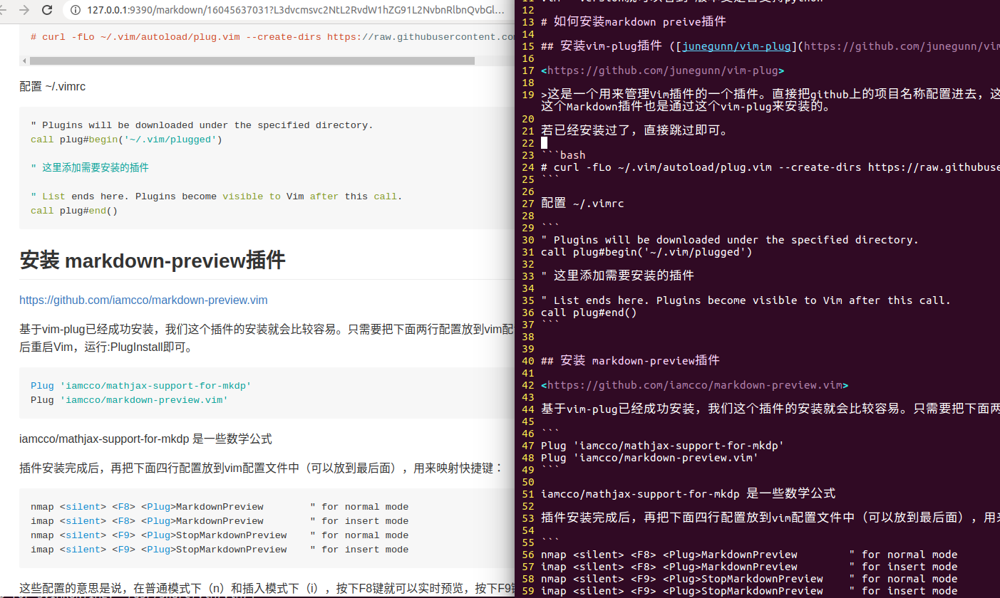

>vim版本要求 7.4，并且要支持python

vim --version就可以看到 版本支是否支持python

# 如何安装markdown preive插件

## 安装vim-plug插件 ([junegunn/vim-plug](https://github.com/junegunn/vim-plug))

<https://github.com/junegunn/vim-plug>

>这是一个用来管理Vim插件的一个插件。直接把github上的项目名称配置进去，这个插件就可以通过一条命令直接下载项目，并且安装到Vim里。如果插件有更新，也可以通过一条命令直接更新全部插件，非常好用。我们用到的这个Markdown插件也是通过这个vim-plug来安装的。

若已经安装过了，直接跳过即可。

```bash
# curl -fLo ~/.vim/autoload/plug.vim --create-dirs https://raw.githubusercontent.com/junegunn/vim-plug/master/plug.vim
```

配置 ~/.vimrc

```
" Plugins will be downloaded under the specified directory.
call plug#begin('~/.vim/plugged')

" 这里添加需要安装的插件

" List ends here. Plugins become visible to Vim after this call.
call plug#end()
```


## 安装 markdown-preview插件

<https://github.com/iamcco/markdown-preview.vim>

基于vim-plug已经成功安装，我们这个插件的安装就会比较容易。只需要把下面两行配置放到vim配置文件里，然后重启Vim，运行:PlugInstall即可。

```
Plug 'iamcco/mathjax-support-for-mkdp'
Plug 'iamcco/markdown-preview.vim'
```

iamcco/mathjax-support-for-mkdp 是一些数学公式

插件安装完成后，再把下面四行配置放到vim配置文件中（可以放到最后面），用来映射快捷键：

```
nmap <silent> <F8> <Plug>MarkdownPreview        " for normal mode
imap <silent> <F8> <Plug>MarkdownPreview        " for insert mode
nmap <silent> <F9> <Plug>StopMarkdownPreview    " for normal mode
imap <silent> <F9> <Plug>StopMarkdownPreview    " for insert mode
```

这些配置的意思是说，在普通模式下（n）和插入模式下（i），按下F8键就可以实时预览，按下F9键就可以停止预览。




##附
[markdown在线编辑器](http://www.mdeditor.com/ "markdown在线编辑器")
